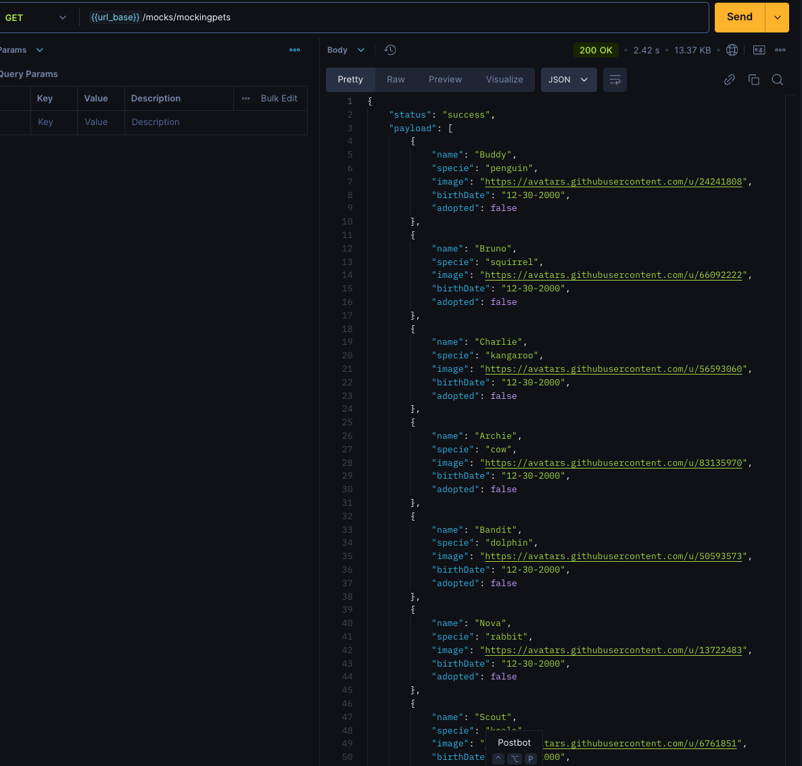
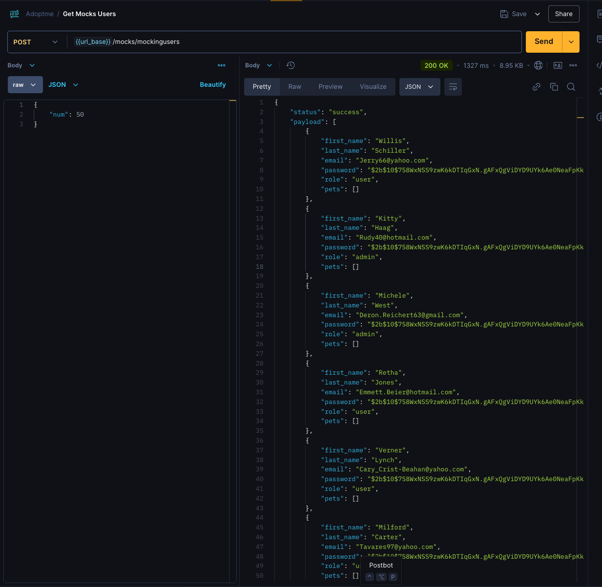
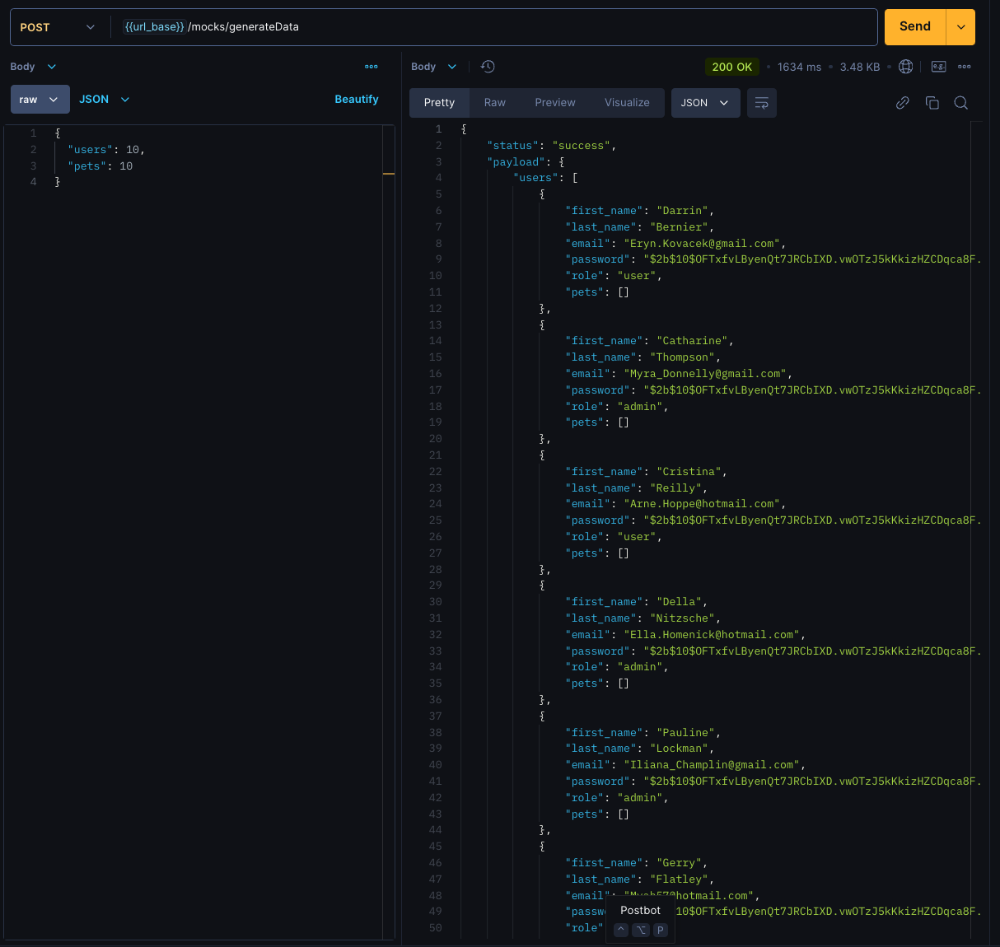
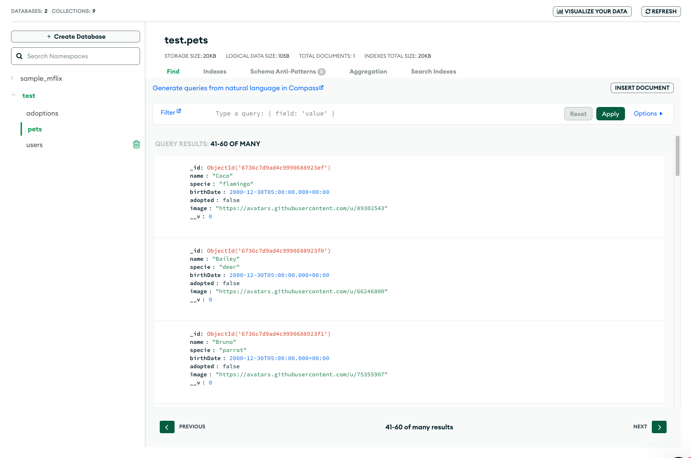
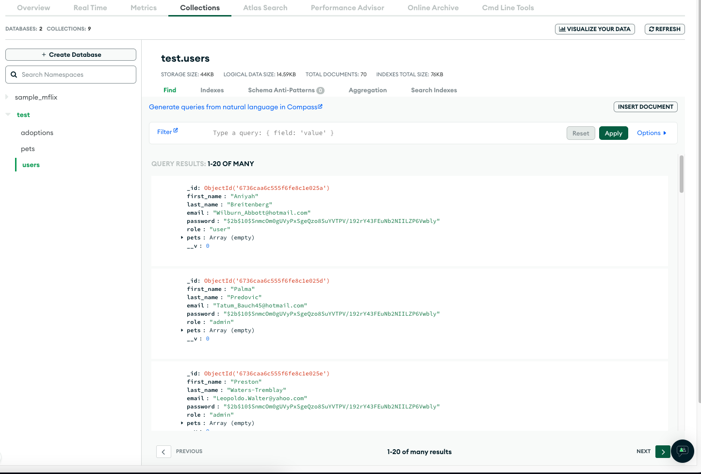

# Jose Perez

La url de mongo esta incluido en el codigo fuente, por temas academicos.

## Primera entrega

### Postman de la ruta /api/mockings/mockingpets

### Postman de la ruta /api/mockings/mockingusers

### Postman de la ruta /api/mockings/generateData

### Mongo Atlas - tabla pets

### Mongo Atlas - tabla users

## Docker

### Contruir imagen

docker build -t joseperu2503/adoptme-app:v1 .

### Ejecutar el contenedor

docker run --name=adoptme-app -dp 3000:3000 adoptme-app

### Docker image url

https://hub.docker.com/r/joseperu2503/adoptme-app
